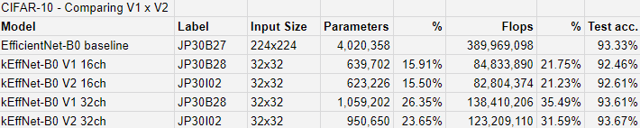
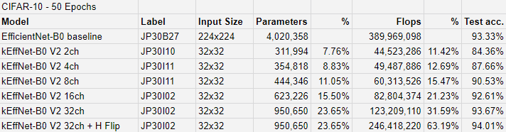
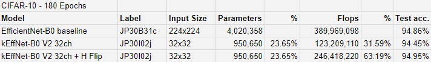
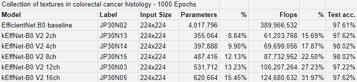
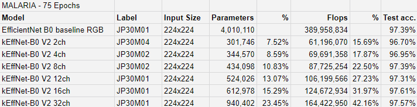

 
# The Raw Results Folder
This folder is organized as follows: `<dataset name-epochs/label>`.

## Experiment Labels
Each raw file has a label in its name. The following tables translate these labels.

</img>

</img>

</img>

</img>

</img>

